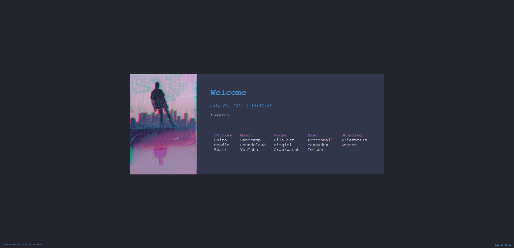

### Single file custom page
It's a customized version of [wolfy's minimal page](https://gitlab.com/wolfiy/wlfys-minimal-startpage "wolfy's minimal page"), with a direct search on Google (you can change that easily) with the searchbar.




### Use
You can use the single page version as-is with FireFox __on Windows__ using this [Firefox configuration](https://old.reddit.com/r/startpages/comments/g3qndt/psa_how_to_set_a_custom_new_tab_page_in_firefox/ "trick"):

1) Open the Firefox installation folder (ex. "C:\Program Files\Mozilla Firefox\")
2) Under this folder, open the `defaults\pref\` folder. If not present, make those two folders.
3) Create a file called `autoconfig.js` inside the folder, and put the following lines in it. Use **Unix line endings**.

      ```
      //
      pref("general.config.filename", "autoconfig.cfg");
      pref("general.config.obscure_value", 0);
      pref("general.config.sandbox_enabled", false);
      ```
4) Go back to the Firefox program folder ("..\\..")
5) Create a file named `autoconfig.cfg`
6) Put the following lines in the file, replacing the value of newTabURL with the path to your startpage (it works for Firefox version 76 or later):
      ```
      //  
      var {classes:Cc,interfaces:Ci,utils:Cu} = Components;  

      /* set new tab page */  
      try {  
        Cu.import("resource:///modules/AboutNewTab.jsm");  
        var newTabURL = "file:///PATH_TO_YOUR_START_PAGE.html";  
        AboutNewTab.newTabURL = newTabURL;  
      } catch(e){Cu.reportError(e);} // report errors in the Browser Console 
      ```
For Chrome go to `Settings > Default Browser > 'Open a specific page or set of pages'`.
