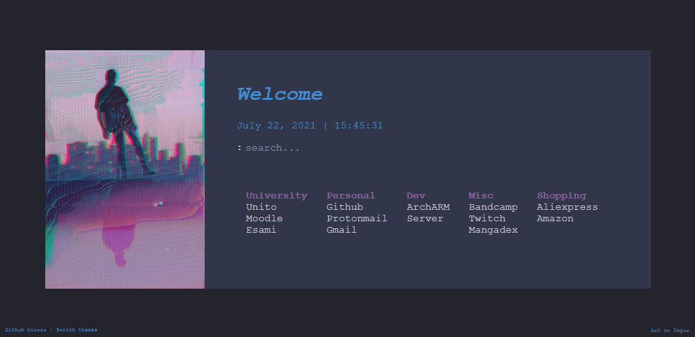

### Single file custom page
It's a customized version of [wolfy's minimal page](https://gitlab.com/wolfiy/wlfys-minimal-startpage "wolfy's minimal page"), with a direct search on Google (you can change that easily) with the searchbar.

### Use
- You can use the single page version as is with FireFox using this [Firefox configuration](https://old.reddit.com/r/startpages/comments/g3qndt/psa_how_to_set_a_custom_new_tab_page_in_firefox/ "trick") (Firefox disabled a while ago a local file to be opened as a new tab). For Chrome, it is really a simple setting, go to Settings > Default Browser > 'Open a specific page or set of pages'.

- Check the 'Switch themes' to go from dark theme to light theme (22/07: it's rough rn, going to add a variable image and a change of color).
